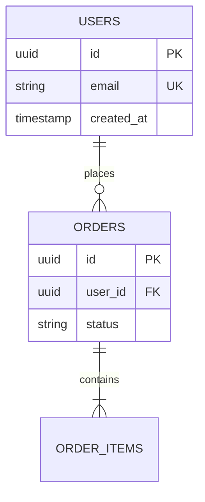

# Database Architecture & Schema Documentation

> **Status**: Verified against active migration scripts.  
> **Source of Truth Rule**: `migrations/` and physical schema scripts are the authoritative source of truth for tables, columns, indexes, and constraints. ORM models must conform to migrations.  
> **Last Audited**: [YYYY-MM-DD]

---

## 1. Database Overview

- **Engine**: [Discovered database engine and version, e.g. PostgreSQL 15, SQLite 3]
- **Connection Configuration**: [`src/config/database.ts`](file:///c:/project/src/config/database.ts) → `dbConfig`
- **Migration Tool**: [Discovered migration tool, e.g. Drift, Flyway, Prisma]
- **Migrations Directory**: [`migrations/`](file:///c:/project/migrations)

---

## 2. Verified Entity Relationship Diagram (ERD)



---

## 3. Table Specifications

### 3.1 `[table_name]`

- **Purpose**: [Brief description of what this table stores based on verified code]
- **Authoritative Migration**: [`migrations/001_create_[table_name].sql`](file:///c:/project/migrations/001_create_table.sql)
- **Model Representation**: [`src/models/[model].ts`](file:///c:/project/src/models/model.ts) → `ModelClass`

| Column | Type | Nullable | Constraints | Description |
| :--- | :--- | :--- | :--- | :--- |
| `id` | UUID / INT | No | PRIMARY KEY | Unique record identifier |
| `created_at` | TIMESTAMP | No | DEFAULT CURRENT_TIMESTAMP | Record creation timestamp |
| `updated_at` | TIMESTAMP | No | DEFAULT CURRENT_TIMESTAMP | Last record update timestamp |

#### Indexes & Foreign Keys
- **Indexes**: `idx_[table]_[column]` on `[column]`
- **Foreign Keys**: `[fk_column]` references `[parent_table](id)` ON DELETE RESTRICT

---

## 4. Migration & Environment Setup

```bash
# Apply pending migrations
npm run db:migrate
# or
flutter pub run build_runner build
```

> **Security Warning**: Database connection strings in local `.env` must never be committed:
> `DATABASE_URL=postgres://<DB_USER>:<DB_PASSWORD>@<DB_HOST>:<DB_PORT>/<DB_NAME>`
